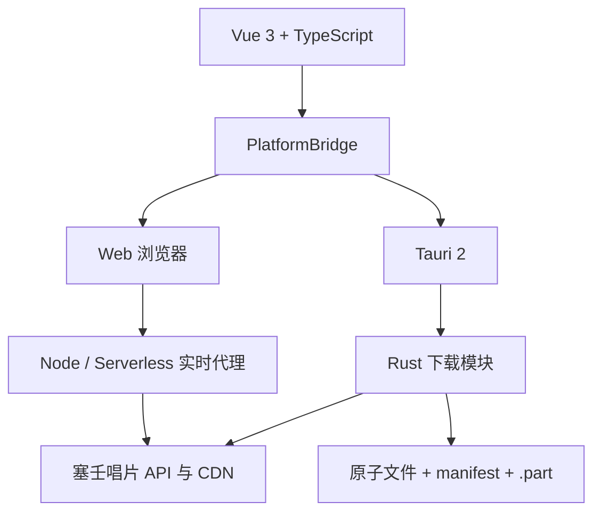

# 塞壬唱片下载器跨平台版

当前版本：<!-- app-version:start -->v1.4.0<!-- app-version:end -->。这是与旧 Electron 版隔离的 Vue 3 + TypeScript + Tauri 2 项目；旧版位于 `resources/app`，继续使用 v5.x 版本线，本目录使用 v1.x。

本项目从塞壬唱片官网实时读取公开目录，并保存官网提供的原始音频格式。不会把 MP3、AAC 等有损音频转成 WAV 后称为无损。使用者应遵守当地法律、官网条款与版权规则，下载内容仅限个人学习和研究用途。

## 平台差异

| 功能 | Web | Windows / macOS / Linux |
|---|---|---|
| 官网目录、搜索、详情、队列 | 支持 | 支持 |
| 下载方式 | 实时代理后交给浏览器，或 Chromium 文件流写入 | Rust 直接流式写入 |
| 保存位置 | 由浏览器管理 | 可选择并持久化下载目录 |
| 断点恢复 | 文件流写入时支持单 Range 重试；浏览器接管由浏览器决定 | `.part`、ETag、Last-Modified、Range |
| 已下载判断 | 本设备确认完成的记录 | manifest 与真实文件大小校验 |
| 原始格式 | 支持 | 支持 |

Safari、Firefox、Android 与 iOS 不允许网页稳定控制本地文件流，因此下载会由浏览器下载管理器接管。应用只能显示“已交给浏览器”，不能把它误记为已确认完成。Chrome、Edge 在用户授权文件写入后按块保存，不把完整音频保存在 Blob 中。

## 架构



前端不使用目录快照中的临时 `sourceUrl`。每次 Web 下载请求 `GET /api/audio?id=<CID>`；代理实时获取最新签名并直接流式转发，不把签名地址暴露给浏览器。

## 开发与验证

需要 Node.js 20、Rust stable，以及对应平台的 Tauri 2 系统依赖。Windows 需要 WebView2 与 Microsoft C++ Build Tools；macOS 需要 Xcode Command Line Tools；Linux 需要 WebKitGTK 4.1、OpenSSL、AppIndicator 等发行版包。

```powershell
npm ci
npm test
npm run typecheck
npm run build
npm run check:scripts
npm run test:e2e
cd src-tauri
cargo fmt --check
cargo clippy --locked -- -D warnings
cargo test --locked
cargo check --locked
```

Playwright 首次运行前执行 `npx playwright install chromium firefox webkit`。Docker 冒烟检查使用 `npm run test:docker`，会构建临时镜像并验证 `/api/health`、首页和 `/api/catalog`。

## Web 部署

### 同源 Node 或 Docker

```powershell
npm run web
```

访问 `http://127.0.0.1:4173`。Docker：

```powershell
docker build -t siren-records-web .
docker run --rm -p 4173:4173 siren-records-web
```

运行镜像包含 `web-server.mjs`、`official-proxy.mjs` 与流量限制模块，并提供 `/api/health`。

### Vercel / Serverless

把 `cross-platform` 设为项目根目录部署。必须同时发布 `api/` 和静态构建，不可只上传 `dist`。部署后检查 `/api/health`、`/api/catalog` 与 `/api/audio?id=<有效CID>`。

### GitHub Pages 或其他静态站点

静态站点不能执行音频代理。先部署 Node/Serverless 代理，再设置构建变量：

```text
SIREN_API_BASE_URL=https://你的代理域名
```

GitHub Pages 工作流会把它写入运行时配置。直接双击 `index.html` 只能使用目录快照；浏览器的 CORS 和临时签名规则无法由纯静态页面绕过。

## 代理与隐私

代理只处理歌曲 CID、必要请求头和音频流，不保存音频内容。桌面 manifest 仅保存在本机应用数据目录，包含 CID、文件路径、大小和完成时间；Web 下载记录保存在当前浏览器的 IndexedDB/localStorage。

生产环境建议配置：

```text
SIREN_ALLOWED_ORIGINS=https://你的网页域名
SIREN_AUDIO_HOSTS=hycdn.cn
SIREN_MAX_AUDIO_BYTES=1073741824
SIREN_AUDIO_RATE_LIMIT=8
SIREN_CATALOG_RATE_LIMIT=60
SIREN_RATE_LIMIT_WINDOW_MS=60000
SIREN_TRUSTED_PROXIES=127.0.0.1,你的反向代理地址
```

只有明确设置 `SIREN_TRUST_PROXY=1`，或连接来自 `SIREN_TRUSTED_PROXIES`/回环地址时，服务才读取 `x-forwarded-for`、`x-forwarded-host` 等头。Serverless 多实例之间不会共享内存限流；可设置 `SIREN_RATE_LIMIT_URL` 与可选 `SIREN_RATE_LIMIT_TOKEN`，让外部服务接收 `{ key, limit, windowMs }` 并返回 `{ allowed, limit, remaining, resetAt }`。未配置或外部服务短暂失败时会退回单实例内存限流，这不能替代平台级 WAF 或全局限流。

静态服务默认发送 CSP、Referrer-Policy、X-Content-Type-Options 和 Permissions-Policy。跨域部署时还必须把网页来源加入 `SIREN_ALLOWED_ORIGINS`。

## 桌面发布

根目录 `.github/workflows/desktop-bundles.yml` 在 `v*` 标签或手动触发时构建 Windows x64、macOS Universal、Linux x64，生成 SHA-256 校验文件并发布正式 Release。macOS 可使用 `APPLE_CERTIFICATE`、`APPLE_CERTIFICATE_PASSWORD`、`APPLE_SIGNING_IDENTITY`、`APPLE_ID`、`APPLE_PASSWORD`、`APPLE_TEAM_ID` 完成签名和公证；未配置证书时仍生成产物，并包含明确的 `SIGNING-STATUS.txt` unsigned 标记。

## 版本管理与已知限制

`package.json` 是跨平台版唯一人工维护版本来源。`npm run version:sync` 同步 Cargo、Tauri 与本 README；`npm run version:check` 用于 CI 和 Release 标签校验。

已知限制：浏览器接管下载后无法向网页确认最终文件是否保存；iOS 对后台大文件下载和多任务有系统限制；GitHub Pages 必须依赖外部 HTTPS 代理；未签名的 macOS 构建可能被 Gatekeeper 拦截；Serverless 内存限流不是全局限流。
