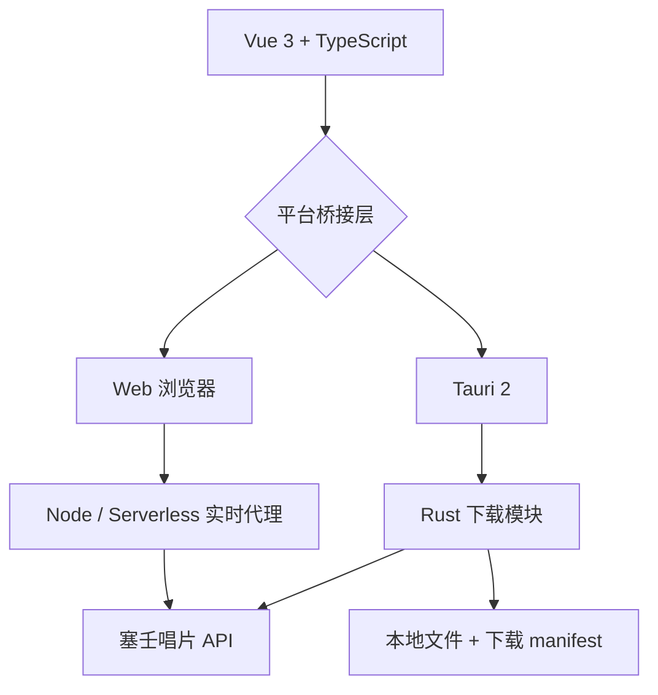

# 塞壬唱片下载器跨平台版

这是与原 Electron 版隔离的 Vue 3 + TypeScript + Tauri 2 项目，当前版本为 <!-- app-version:start -->v1.3.1<!-- app-version:end -->。它提供音乐库、官网目录、搜索定位、已下载分类、下载队列、歌曲详情和关于页。

下载队列支持持久化、1～3 个并发任务、队列暂停、单项取消、失败重试、去重、实时进度、速度和剩余时间。网页端使用浏览器默认下载目录；桌面端使用系统 Downloads 目录。

Web 和桌面端均保留官网提供的原始音频格式。项目不会把 MP3、AAC 等有损音频转换成 WAV 后宣传为无损；这种转换只会增大文件，无法恢复已经丢失的音频信息。桌面端会保存下载 manifest，并在启动时检查真实文件是否仍然存在。

## 架构



## 环境要求

- Node.js 20 或更高版本
- Rust stable 工具链
- 对应平台的 Tauri 系统依赖

Windows 需要 Microsoft C++ Build Tools 和 WebView2；macOS 需要 Xcode Command Line Tools；Linux 需要 WebKitGTK 4.1 等发行版依赖。

## 本地开发与检查

```powershell
npm ci
npm run check
npm run build
npm run tauri dev
```

`npm run check` 会运行前端测试、TypeScript 检查和 Node 代理脚本语法检查。Rust 后端使用：

```powershell
cd src-tauri
cargo check --locked
```

## 版本管理

`package.json` 是跨平台版唯一的人工维护版本来源。运行 `npm run version:sync` 会同步 Tauri、Cargo 和 README；应用界面由 Vite 构建时直接读取该版本。`npm run version:check` 和 Release 工作流会阻止版本文件或 Git 标签不一致的构建。跨平台版使用 `v1.x`，旧 Electron 版继续使用 `v5.x`。

## Web 下载架构

前端不会使用目录快照中的 `sourceUrl` 下载音频。每次下载都请求：

```text
GET /api/audio?id=歌曲CID
```

后端代理会实时请求塞壬唱片歌曲接口，取得当前有效的官网音频地址，再以流式方式转发。这样不会把短时效 CDN 签名写入静态构建产物。

支持文件系统写入 API 的 Chromium 浏览器会把响应分块直接写入用户选择的文件，不构造完整 Blob。Android Chrome、iOS Safari 等不支持该 API 的浏览器会把音频地址交给系统下载管理器流式保存，并自动限制为串行启动，避免移动浏览器拦截多个下载。移动浏览器无法向网页反馈系统下载管理器的最终结果，因此网页中的“已下载”明确表示本设备的下载操作记录。

代理包含以下基础保护：

- 仅允许配置的浏览器来源或同源页面调用；
- 按客户端地址限制目录和音频请求频率；
- 校验歌曲 CID、上游 HTTPS 地址和允许的音频域名；
- 限制单个音频响应大小，并在用户取消时中断上游请求。

本地完整 Web 模式：

```powershell
npm run web
```

访问 `http://127.0.0.1:4173`。此模式由同一个 Node 服务提供页面、目录代理和音频代理。

## 部署方式

### Vercel 或兼容 Serverless 平台

将 `cross-platform` 设为项目根目录后部署，不要只上传 `dist`。Vercel 会同时发布静态页面与 `api/catalog.mjs`、`api/audio.mjs`，前端默认使用同源 `/api`，不需要设置 `VITE_API_BASE_URL`。

部署后检查：

```text
https://你的域名/api/catalog
https://你的域名/api/audio?id=779442
```

第一个地址应返回目录 JSON，第二个地址应开始返回音频。

### GitHub Pages

GitHub Pages 只能托管静态文件，不能运行 `/api`。必须先将 `cross-platform` 部署到 Vercel、Render、Railway 或其他可运行 Node/Serverless 的平台，再在 GitHub 仓库中添加 Actions 变量：

```text
SIREN_API_BASE_URL=https://你的代理域名
```

根目录 `.github/workflows/cross-platform-web-pages.yml` 会将该变量作为 `VITE_API_BASE_URL` 构建网页。没有配置 HTTPS 代理地址时，工作流会停止发布，避免生成无法下载的站点。

### 其他静态托管

构建时设置：

```text
VITE_API_BASE_URL=https://你的代理域名
```

也可以在构建后编辑 `dist/runtime-config.js`：

```javascript
window.__SIREN_API_BASE__ = 'https://你的代理域名';
```

单独打开或上传一个未配置代理的 `index.html` 只能浏览目录，无法绕过官网 CORS，也无法刷新音频签名。

### Docker、Render 或 Railway

Docker：

```powershell
docker build -t siren-records-web .
docker run -d --name siren-records-web -p 4173:4173 siren-records-web
```

Node 托管平台的构建命令设为 `npm ci && npm run build`，启动命令设为 `npm start`。服务会读取平台提供的 `PORT` 并监听 `0.0.0.0`。

## 代理安全配置

生产环境建议配置：

```text
SIREN_ALLOWED_ORIGINS=https://你的网页域名
SIREN_AUDIO_RATE_LIMIT=8
SIREN_CATALOG_RATE_LIMIT=60
SIREN_RATE_LIMIT_WINDOW_MS=60000
SIREN_MAX_AUDIO_BYTES=1073741824
SIREN_AUDIO_HOSTS=hycdn.cn
```

多个允许来源使用英文逗号分隔。默认允许项目 GitHub Pages 地址和本地开发地址；同源部署会自动放行。`file://` 的 `Origin: null` 默认拒绝，如确需支持可显式设置 `SIREN_ALLOW_NULL_ORIGIN=1`。

## GitHub Actions

所有工作流位于仓库根目录 `.github/workflows/`：

- `ci.yml`：前端测试、TypeScript、生产构建及 Rust `cargo check --locked`；
- `cross-platform-web-pages.yml`：构建并发布配置了实时代理的 GitHub Pages；
- `desktop-bundles.yml`：生成 Windows x64、macOS Universal 和 Linux x64 安装包。

原版 Electron 目录不在本项目构建范围内，跨平台代码和产物都位于 `cross-platform` 文件夹。
